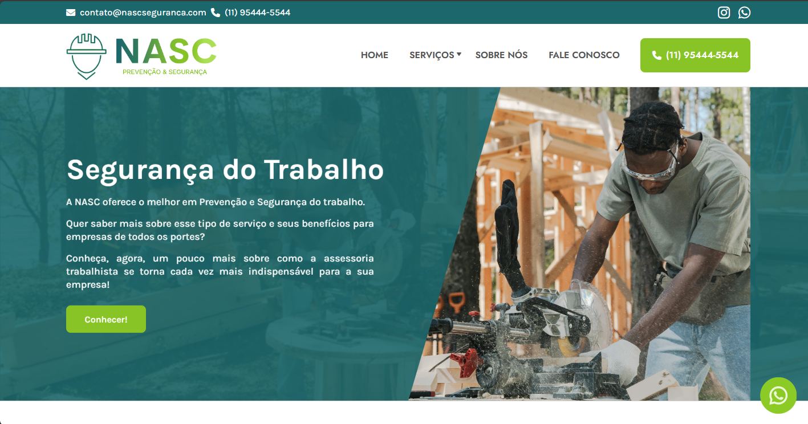

# NASC

A NASC é um Freelance feito usando HTML/CSS/JS, para uma empresa que fornece treinamentos e documentações de segurança do trabalho, foi o meu segundo freelance e o cliente gostou e esse foi o resultado final.

[EN] NASC is a Freelance made using HTML/CSS/JS, for a company that provides workplace safety training and documentation, it was my second freelance and the client liked it and that was the final result.

## Como rodar o projeto

https://nascseguranca.com/

1. Faça download do projeto
2. Abra o index.html que se encontra na raíz do projeto.
5. Aprecie 🚀

## Home

## Feedback

Se você tiver algum feedback, por favor me informe para eu evoluir meus conhecimentos.

[EN] If you have any feedback, please let me know so I can improve my knowledge.

## Contribuindo

Contribuições são sempre bem-vindas!

[EN] Contributions are always welcome!

